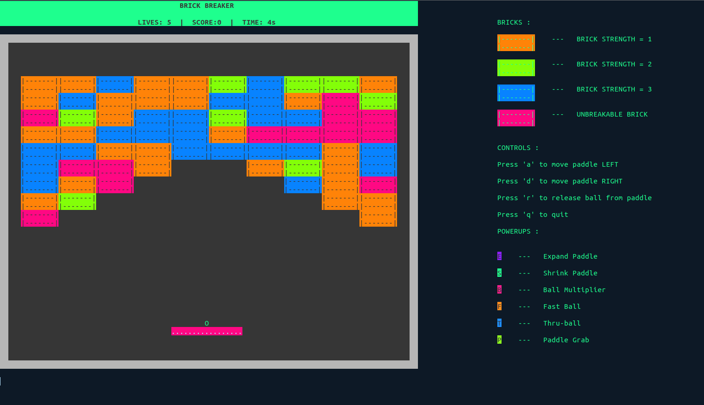

# BRICK BREAKER

This game is a terminal version of the classic Brick Breaker game build completely in python using the colorama and numpy modules only.

## Setup

Libraries used :

```bash
pip3 install colorama
```

## Execution

To play :

```bash
git clone https://github.com/manasvi-26/Brick-Breaker
cd Brick-Breaker
python3 main.py
```

## Rules

**a** - To move left
**d** - To move right
**r** - To release Ball

## Features
- There are 4 types of Bricks of varying strength and color:
- 6 kinds of powerups with a timeout of 10s each and appear when you break a brick.
- You win the game when you break all the Breakable Bricks.



## OOPS Concepts Used:
- **Inheritance** - The classes `ExpandPaddle`, `ShrinkPaddle`, `BallMultiplier` , `FastBall`, `ThruBall`  and  `PaddleGrab`  are all inherited from the same parent class `Powerup`.  Common atrributes and methods such row , col , activated,  move() , clear() , show(),  are inherited thereby avoiding reduntant code.

- **Polymorpism** - Implemented one parent power-up class called `PowerUp` and override the `activate` and `deactivate` functions to execute power-up in the child classes (made 6 classes for each kind of powerup).

- **Encapsulation** - Every component on the board is an object of a class. This instantiation encapsulates the methods and attributes of the objects.

- **Abstraction** -  The functions like `break_brick()` , `move()`, `collide` hide the inner details of the function enabling users to use just the function name. 
